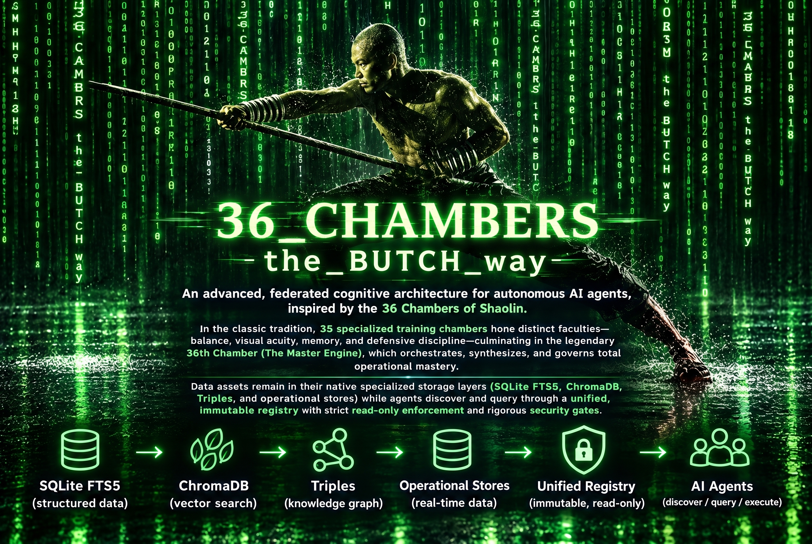
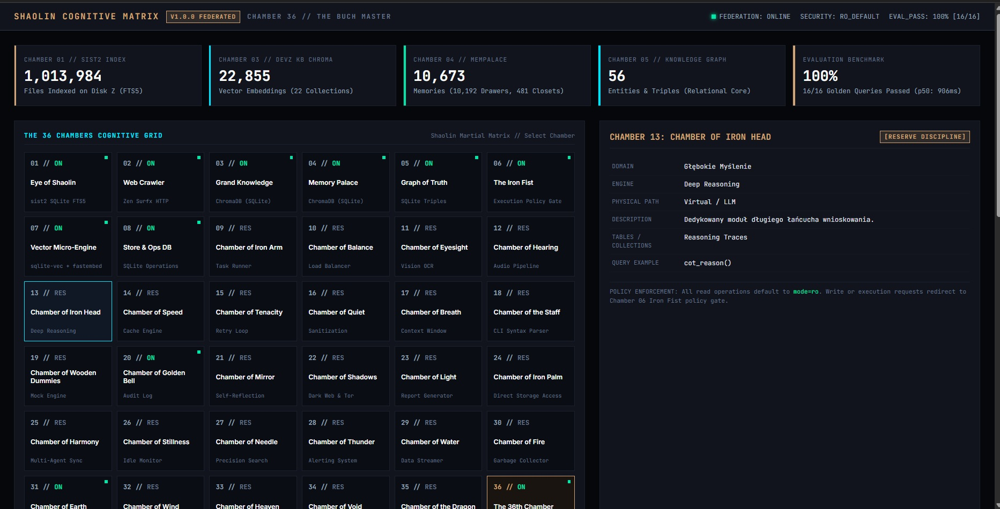

# 36 Chambers of Shaolin Cognitive Matrix

[](LICENSE)
[](docs/security/FOUR_ROOM_PIPELINE.md)
[](RADM.md)

<p align="center">
  
</p>

An advanced, federated cognitive architecture for autonomous AI agents, inspired by the 36 Chambers of Shaolin. In the classic tradition, 35 specialized training chambers hone distinct faculties—balance, visual acuity, memory, and defensive discipline—culminating in the legendary **36th Chamber (The Master Engine)**, which orchestrates, synthesizes, and governs total operational mastery.

Data assets remain in their native specialized storage layers (SQLite FTS5, ChromaDB, Triples, and operational stores) while agents discover and query through a unified, immutable registry with strict read-only enforcement and rigorous security gates.

---

## Architecture Overview

<p align="center">
  
</p>

```text
                                [ User / CLI / API ]
                                         │
                                         ▼
                     ┌──────────────────────────────────────┐
                     │   CHAMBER 36: THE MASTER ENGINE      │
                     │  (Shaolin Orchestrator & Synthesizer)│
                     └───────────────────┬──────────────────┘
                                         │
                 ┌───────────────────────┼───────────────────────┐
                 │                       │                       │
                 ▼                       ▼                       ▼
     ┌───────────────────────┐ ┌───────────────────┐ ┌───────────────────────┐
     │  CHAMBER 06: IRON FIST│ │ CHAMBERS 01-05,07 │ │ CHAMBER 36: OBSERVATORY│
     │ Four-Room Quarantine  │ │ Federated Adapters│ │ Telemetry & Dashboards│
     │ Anti-Injection Gate   │ │ FTS/Vector/Graph  │ │ Knowledge Growth DB   │
     └───────────────────────┘ └───────────────────┘ └───────────────────────┘
```

### Federated Chambers Taxonomy

| Chamber | Designation | Silnik / Adapter | Specialized Role |
|---|---|---|---|
| **01** | Eye of Shaolin | SQLite FTS5 / `sist2` | High-throughput text indexing & forensic filesystem search |
| **02** | Web Crawler & Edge | HTTP (Zen Surfx) | Outbound HTTP retrieval & edge scraping |
| **03** | Grand Knowledge | ChromaDB | Semantic embeddings for core engineering & repository knowledge |
| **04** | Memory Palace | ChromaDB / MemPalace | Long-term episodic memory, associative recall & drawers |
| **05** | Graph of Truth | SQLite Triples | Entity relationships, knowledge graph facts & assertions |
| **06** | The Iron Fist | Four-Room Security Gate | Mutation blocking, SHA-256 verification & ingestion quarantine |
| **07** | Vector Micro-Engine | `sqlite-vec` + `fastembed` | Fast in-process vector similarity and local embeddings |
| **08** | Store & Operations | SQLite (read-only) | Transactional operational store, sessions, chat history |
| **36** | **The 36th Chamber** | **Master Orchestrator** | **Multi-threaded query routing, evidence synthesis, telemetry** |

---

## Key Subsystems

### 1. Four-Room Security Pipeline
Untrusted intake and resource deprecation follow a deterministic 72-hour security cycle:
- `00_Invitation_Quarantine` (*The Invitation Room*): Intake, SHA-256 fingerprinting, magic bytes MIME verification, Defender scanning, text injection heuristic analysis.
- `01_Rookie_Validation` (*The Rookie Room*): Isolated LLM evaluation using strict JSON schemas before promotion to candidate status.
- `98_Retirement_Quarantine` (*You-No-Longer-Need-Me Room*): Pre-retirement dependency analysis and backup validation.
- `99_Deletion_Hold` (*The Bye-Bye Room*): Restore testing and final manual approval gate.

### 2. Knowledge Growth & Utilization Observatory
Tracks the lifecycle, frequency, and health of knowledge assets across all chambers:
- Ingests events into `knowledge_observatory.sqlite`.
- Identifies "cold assets" (knowledge never retrieved by any agent).
- Generates interactive Plotly dashboards and markdown telemetry reports.

### 3. Automated Golden Queries Evaluation
- Validates routing precision, retrieval recall@k, and safety policy compliance against 16+ curated golden scenarios.
- Generates confusion matrices, route pass rates, and latency breakdowns.

### 4. OpenRouter Mini-Benchmark
- Measures model latency, throughput, token costs, and API error rates across providers.

---

## Directory Structure

```text
36_chambers/
├── README.md                          # Master documentation
├── RADM.md                            # Repository Architecture & Decision Manual
├── LICENSE                            # PolyForm Noncommercial License 1.0.0
├── NOTICE                             # Copyright & noncommercial notice
├── COMMERCIAL_LICENSE.md              # Terms for commercial licensing
├── DATA_LICENSE.md                    # Data boundary specifications
├── SECURITY.md                        # Security policy & reporting
├── .gitignore                         # Strict exclusion of secrets/databases
├── .env.example                       # Environment variable templates
├── requirements.txt                   # Production runtime dependencies
├── requirements-dev.txt               # Development & security audit tooling
│
├── src/                               # Executable engine components
│   ├── orchestrator/                  # Shaolin Orchestrator & federation engine
│   ├── security/                      # Four-Room Quarantine controller & policies
│   ├── observatory/                   # Knowledge scanner, importer & dashboards
│   ├── evaluation/                    # Golden queries runner & eval dashboard
│   └── analytics/                     # OpenRouter benchmark engine
│
├── docs/                              # In-depth architectural & operational specs
│   ├── architecture/                  # Architecture blueprints & contracts
│   ├── security/                      # Pipeline, injection defense & least privilege
│   └── operations/                    # Observatory, evaluation & release guides
│
└── examples/                          # Synthetic demo configurations & test fixtures
    ├── demo_registry/                 # Sanitized 36 Chambers registry example
    ├── demo_golden_queries/           # Example golden test scenarios
    ├── sample_event_logs/             # Demo retrieval telemetry logs
    └── sample_canary/                 # Public demonstration canary marker
```

---

## Quick Start

### 1. Prerequisites
- Python 3.10+ (Python 3.13 recommended)
- Windows PowerShell 7+ or Linux/macOS bash
- Git

### 2. Installation
```bash
git clone https://github.com/Bonzokoles/36_chambers.git
cd 36_chambers

# Create and activate virtual environment
python -m venv .venv
source .venv/bin/activate  # On Windows: .\.venv\Scripts\Activate.ps1

# Install dependencies
pip install -r requirements.txt
```

### 3. Configure Environment
```bash
cp .env.example .env
# Edit .env with your local paths and API keys (never commit .env)
```

### 4. Run the Master Orchestrator
```bash
python src/orchestrator/shaolin_orchestrator.py "Where is the agent provider configured?"
```

### 5. Inspect Quarantine Status
```bash
python src/security/four_room_quarantine.py status
```

### 6. Run Knowledge Observatory Pipeline
```powershell
pwsh -ExecutionPolicy Bypass -File src/observatory/run_knowledge_observatory.ps1
```

---

## Governance & Architecture Decisions

For complete architectural specifications, Architectural Decision Records (ADRs), component ownership models, and operational risk matrices, consult [`RADM.md`](RADM.md) (**Repository Architecture and Decision Manual**).

---

## Licensing

- **Code & Architecture**: Licensed under the **PolyForm Noncommercial License 1.0.0**. Free for individual, academic, and noncommercial research use. See [`LICENSE`](LICENSE) and [`NOTICE`](NOTICE).
- **Commercial Use**: Commercial utilization, paid SaaS hosting, enterprise integration, or consulting deployments require a separate written agreement. Refer to [`COMMERCIAL_LICENSE.md`](COMMERCIAL_LICENSE.md).
- **Data Boundaries**: No production databases, private keys, vector weights, or proprietary memories are included or licensed. See [`DATA_LICENSE.md`](DATA_LICENSE.md).
